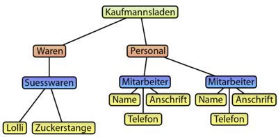

### XML
- eXtensible Markup Language
- erweiterbare Auszeichnungssprache

%--
#### Auszeichnungssprachen

- [html](https://www.w3schools.com/html/tryit.asp?filename=tryhtml_basic_document): Sprache des Web
- [latex]([examples/anton_flyer.txt](https://guides.nyu.edu/LaTeX/sample-document)): Anspruchsvolle Drucksachen, Naturwissenschaftliche/Mathematische Publikationen
- [mediawiki](https://www.mediawiki.org/wiki/Help:Formatting/de): Wikipedia u.ä.
- [markdown](https://www.markdownguide.org/cheat-sheet/): Blogging, GSK-Wiki, diese Präsentation

%--
### Beispiele
[Bild/Original](images/winckelmann.png)  
[Text](examples/01_winckelmann.txt)  
[HTML](examples/02_winckelmann.html) [ [src](examples/02_winckelmann.txt) ]  
[XML](examples/03_winckelmann.xml) [ [src](examples/03_winckelmann.txt) ]

%--
### XML / HTML
* HTML die Darstellung von Daten vorgesehen 
* HTML: Limitation auf ca. 100 Tags
* XML soll Daten beschreiben 
* XML ist für eine strukturierte Datenhaltung geeignet 
* XML ist beschreibend nicht entworfen, um Aktionen auszuführen 
* XML Tags/Elemente sind nicht vordefiniert 

%--
### XML Details
* XML ist strenger definiert (case-sensitive, Attributwerte zwingend in Anführungszeichen)
* XML: Start-Tag muss immer auch End-Tag haben 
* XML weist dem IMG-Tag keine spez. Bedeutung zu 

%--
### XML: Terminologie I
Deklaration am Beginn des Dokuments 
```xml
<?xml version="1.0" encoding="UTF-8"?>
```
Tags / Elemente
```xml
<element>content</element>
``` 
Attribute 
```xml
<element attribut="content des attributs">
```
Kommentare 
```xml
<!-- Kommentar -->
```

%--
### XML: Regeln
Jedes Element hat einen Start-Tag und einen End-Tag  

Gross- und Kleinschreibung machen einen Unterschied Gross ≠ gross

Tags ohne Inhalte (leere Tags) können abgekürzt geschrieben werden

```xml
<leererTag></leererTag>
<leererTag />
```

%--
### Hierarchie
Tags können verschachtelt werden, so dass eine Baum-Hierarchie entsteht.
```xml
<root>
  <child>
    <grandchild>.....</grandchild>
  </child>
</root>
```


%--
### Hierarchie: XML
```xml
<?xml version="1.0" encoding="UTF-8" standalone="yes"?>
<Kaufmannsladen>
    <Waren>
        <Suesswaren>
            <Lolli preis="5,00" />
            <Zuckerstange preis="2,00" />
        </Suesswaren>
    </Waren>
    <Personal>
        <Mitarbeiter id ="2">
            <Name>Dobermann</Name>
            <Anschrift>Beispielweg</Anschrift>
            <Telefon>515248</Telefon>
        </Mitarbeiter>
        <Mitarbeiter id="3">
            <Name>Meier</Name>
            <Anschrift>Knutallee</Anschrift>
            <Telefon>22222</Telefon>
        </Mitarbeiter>
    </Personal>
</Kaufmannsladen>
```

%--
### XML: Nur eine Hierarchie

```xml
<anthology> 
  <poem>
    <heading>The SICK ROSE</heading> 
    <stanza>
        <line>O Rose thou art sick.</line> 
        <line>The invisible worm,</line> 
        <line>That flies in the night</line> 
        <line>In the howling storm:</line>
    </stanza> 
    <stanza>
        <line>Has found out thy bed</line> 
        <line>Of crimson joy:</line> 
        <line>And his dark secret love</line> 
        <line>Does thy life destroy.</line>
    </stanza> 
  </poem>
<!-- more poems go here -->
</anthology>
```

%--
<font color="red">Nicht erlaubt:</font>

```xml
<anthology> 
  <poem>
    <heading>The SICK ROSE</heading> 
    <stanza>
        <line><sentence>O Rose thou art sick.</sentence></line> 
        <line><sentence>The invisible worm,</line> 
        <line>That flies in the night</line> 
        <line>In the howling storm:</line>
    </stanza> 
    <stanza>
        <line>Has found out thy bed</line> 
        <line>Of crimson joy:</sentence></line> 
        <line><sentence>And his dark secret love</line> 
        <line>Does thy life destroy.</sentence></line>
    </stanza> 
  </poem>
<!-- more poems go here -->
</anthology>
```

%--
### OHCO

Ordered Hierarchy of Content Objects

Problem der überlappenden Auszeichnungen:

<em>KURSIV</em>___FETTUNDKURSIV___<strong>FETT</strong>

<font color="red">Nicht erlaubt:</font>
```xml
<kursive>KURSIV<fett>FETTUNDKURSIV</kursiv>FETT</fett>
```

Note:
- Kritik an XML und TEI und viele Versuche mit anderen Technologien zu arbeiten (Standoff)
- Demgegenüber: XML ist schon komplex, aber 

%--
### XML Eine einzige strukturelle Hierarchie

Quelltexte haben aber mindestens 2 strukturelle Hierarchien:

- physische Struktur (z.B. Seiten, Layout)
- logische Struktur (z.B. Kapitel, Absätze)

%--
### Mögliche Lösung 
```xml
<anthology> 
  <poem>
    <heading>The SICK ROSE</heading> 
    <stanza_start />
    <linebreak />
    <sentence>O Rose thou art sick.</sentence> 
    <linebreak />
    <sentence>The invisible worm, 
        <linebreak />That flies in the night 
        <linebreak />In the howling storm: 
        <stanza_start />
        <linebreak />Has found out thy bed 
        <linebreak />Of crimson joy:
    </sentence> 
    <linebreak />
    <sentence>And his dark secret love 
        <linebreak />Does thy life destroy.
    </sentence>
  </poem>
<!-- more poems go here -->
</anthology>
```

%--
### Schemata: Definition von XML-Strukturen
- XML stellt eine allgemeine Syntax zur Verfügung
- Durch die Benennung der Elemente und Attribute kann man eine spezifisch Sprache entwickeln. 
- Definition solcher XML-Sprachen = Schema (verschiedene Schema Sprachen XML Schema, Relax NG, Schematron, DTD)
- Es gibt bereits viele Standard-Sprachen [Wikipedia](https://en.wikipedia.org/wiki/List_of_XML_markup_languages)
- Für die Codierung von Büchern und Texten gibt es bereits verschiedene XML‐Sprachen: TEI, DITA, DocBook, XHTML, MS Word usw.


%--
### XML: Terminologie II

- __well-formed__ (wohlgeformt): Ein XML-Dokument ist XML (erfüllt alle Regeln für XML)
- __valid__ (gültig): Ein XML-Dokument entspricht einem XML-Schema

%--
### Editor z.B. oXygen

https://www.oxygenxml.com/technical_support.html
