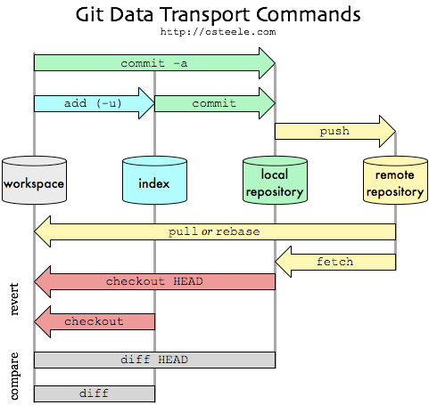

### Git 

%--
#### Git: Workflow

%--
#### Links

https://git-scm.com/book/de/v2/

https://docs.github.com/en/desktop

https://blog.devgenius.io/git-for-absolute-beginners-part-1-42ad66a5866b

%--

#### Workflow GithubDesktop

1. GithubDesktop: Git fetch und pull

2. Arbeit an der Edition (im Moment mit oXygen)

3. GithubDesktop: Commit und push
